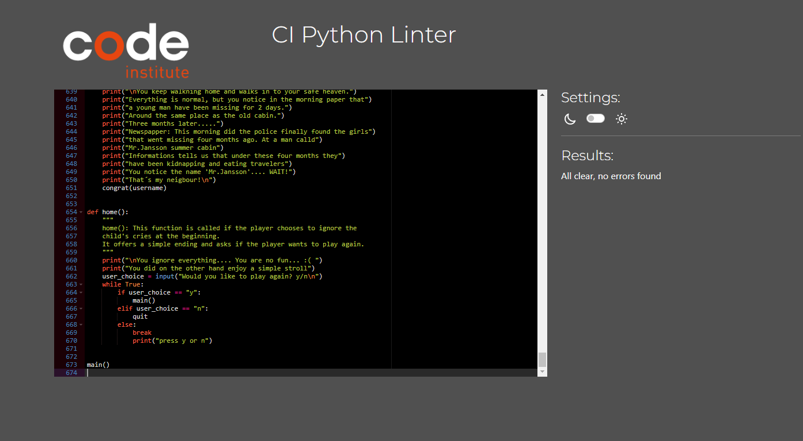
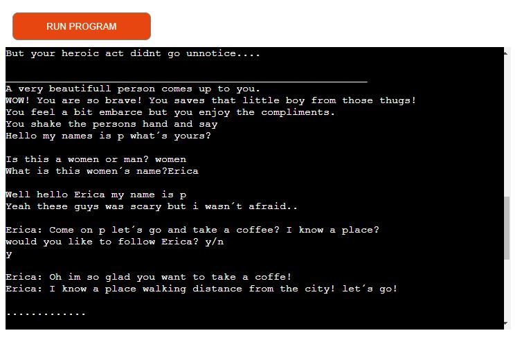

# Welcome to A Simple Stroll Game!

## Introduction
A Simple Stroll is a game for both females and males aged between 16-22 years. The goal of the game is to give the player an exciting and goosebump-inducing experience. It’s a horror game where you go for a simple stroll, and things turn south very quickly. There is an old cabin by the woods with a child crying. What could go wrong?

## How do you play? 
You will follow the story of "A Simple Stroll" and reach points where you need to make decisions. Depending on your answers, you will either have a simple stroll or be hunted by a cannibal.

The player will be able to give names and genders to the characters they meet in the story. There will be 2-3 different paths for the player to choose from.

The player will be able to pick 1, 2, or 3, and y/n depending on the situation.

## Contents
* [Project Goals](#project-goals) 
    * [For the user](#for-the-user)
    * [For the site owner](#for-the-admin)
* [User Experience](#user-experience) 
    * [Target audience](#target-audience)
    * [User requirements](#user-requirements)
    * [User Manual](#user-manual)
    * [User Stories](#user-stories)
* [Technical Design](#technical-design)
    * [Data Models](#data-models)
    * [Flowchart](#flowchart)
* [Features](#features)
    * [App Features](#app-features)
    * [Feature Ideas for future development](#feature-ideas-for-future-development)
* [Technologies Used](#technologies-used)
* [Deployment & Local Development](#deployment--local-development)
* [Testing](#testing)
    * [Validation](#pep8)
    * [Manual Testing](#manual-testing)
    * [Automated Testing](#automated-testing)
    * [Bugs](#bugs)
* [Credits](#credits)

# Project goals

### For the user
- To play a puzzle game where the goal is to survive the stroll.
- To understand the instructions and know how to play.

### For the admin
- To provide players with clear instructions.
- To create a game without errors.

## User Experience

### Target audience
There are no specific users for the site, but the game would suit young users who are in search for a thrill. 
It can alose be played by older users, it all depends on there personal intrest. 

### User requirements
* A game that is understandable and works as expected.
* A game that passes all the variables and functions works as expected. 
* User can quit the game when they want.
* User can continue playing even if they win. 

### User Manual
Click the dropdown to view the user manual:

User Manual

### Main menu
The user will be prompted to enter a player name, and will then be directed to the main menu.
There are 2 options in the menu:
1. Go right into the big and exciting city
2. Go to the left into the adventure full forest. 

### Reading instructions
The user is able to see the instructions to the game in beginning of every new round. 
 

HOW TO PLAY 

You will start the game by entering your name and then
you will get choices to make on your stroll by
pressing y,n,1,2 or 3 depening on the situation"

### Quitting the game
The user is never able to choose to quit the game intentionally untill the player dies, win or goes home. But there are many paths that lead to the end of the game. 

### Playing the game
Once the game is started, the user must choose the right path to keep playing. If the user chooses the wrong path they eather end up dead or walking home and ending the stroll.

#### Player navigation
The player must move the character by typing their moves. 

In order to navigate through levels of the story, the user must type their moves in the format:
y,n,1,2,3
#### Examples
* Would you like to follow molly? y for yes n for no
* You have two choices- 1: Go to the big city. 2:Go to the adventure full forest 

#### Beware
* If the user navigates into a story line where they die they will need to restart the game by pressing y. 
* If the user enters a story line there is no way to retreat. You only have one chance. 

### Completing the game
The goal for the game is to survive a crazy stroll. If the player survive against the odds the player will reveive a "Congratulations" and get the choice to play again or leave. If the user is intrested in following an diffrent storyline 

### Losing the game 
If the player loses to the game, they will recive a "Welcome to the afterlife" and get the choice to play again or leave. If the user is intrested in following an diffrent storyline 

 

### User Stories
(1) Before you sign up with a username to start the game you will see a text that describe the game to encourage the user to start. 

(2) Before you get to pick a path, you will see instructions 

(3) You will get information about your location and your characters whereabout like a story. 

(4) For inputs (whether text or numerical) to work as expected and any erroneous inputs to be flagged by the program.

(5) For the program to give me feedback when I answer game questions correctly or incorrectly.

#### As the site owner...
(6) Ensure that the user understand what's happening in the story.

(7) Ensure that all user actions are given feedback in the terminal so that users feel they know what to do next in the game.

(8) Ensure that if the user input invalid symbols it ittirate back or inform the user about it. 

## Technical Design

### Flowchart

A flowchart was created using [Lucidchart](https://lucid.app/) to visualise the logic flow of the game.

    
Flowchart

    
Dungeon Escape game logic:

    

 

## Features
The website has a single page with several features within the mock python terminal. These features are listed below.

### App Features:

    
Game Title

    
This is what the user sees upon loading the site. 

    <ul>
        <li>
            
Enter name y/n options

        </li>
        <li>
            
        </li>
        <li>

    

 

    
Activites in the Game 

    
This is what the user sees if the user takes the right path in the living city.  

    <ul>
        <li>
            
Who do you meet? Women or man? 

        </li>
        <li>
            
        </li>
        <li>

 

    
Activites in the Game 

    
This is what the user sees if the user end up with Mr.Jansson in the cabin and wants to save the side characters.

    <ul>
        <li>
            
What are you going to do?

        </li>
        <li>
            
        </li>
        <li>

 

### Flowchart

A flowchart was created using [Lucidchart](https://lucid.app/) to visualise the logic flow of the game.

    
Flowchart

    
A simpel stroll lucidchart

    

 

## Why would you want to play this game? 

A Simple Stroll is a game where you, as the player, control the storyline. You control the choices you make and the people you meet along the way. The game is nerve-wracking, making it the perfect "late-night game" when you are alone on a Saturday night in front of your computer.

# Functions
### Input
The player will be able to input their character's name, which will follow throughout the entire story. The player will also be able to input the gender and name of characters they meet during the stroll. If the player meets a woman, the story will use the pronoun "she," and if it's a man, it will use "he."

## Attributes 
- Person_c stands for the person's name.
- Person_c_g stands for gender.
- Pronun stands for pronouns. 
- Username stands for the player´s name.

### Events
There are a lot of events when the player picks the exciting path. The player will always have the option to go home because that’s reality. Who would like to go for a stroll with no option to turn back for like 5 hours?
### Variables 
The people the player meets aren’t static in the game. This makes it important to pass variables further through the game. For example, the variable person_c_g will change a person the player meets from a woman to a man depending on the player's early choices, and their pronouns, of course, are stored in the pronoun variable.

# Testing 

## PEP8 
A Simple Stroll passed the PEP8 checks with no errors, as shown in the image below. The game initially had a lot of PEP8 errors, which have been resolved now. 

## Manual testing

### Start Game 
1. Start the game by entering your name. I used an isalpha function so the user can only use letters. If you use a number, the system will loop back.
### Choose path 
1. The user can pick 1 or 2 depending on whether they want a city stroll or a forest stroll.
2. If the user inputs A or 3, nothing will happen, and they won’t be able to progress in the story until they pick 1 or 2.

### Death

Death

1. When the player dies, they have 2 options.
2. They can pick y to play again.
3. They can also pick n to leave. 
4. If they pick y, they will go back to the start game function.
<h2>These steps works as expected.</h2>

### Congratulation 

Congratulation

1. When the player survives the stroll, they will reach the congrats function.
2. At this point, they have 2 choices:
- Press y to play again, returning to the start game function.
- Press n to leave the game.
<h2>These steps works as expected.</h2>

### Persons in the story

Persons in the story

1. Inside the Hide Boy function, the user can choose the gender (woman or man) of the person they meet.
2. If the player chooses a woman, the story changes to use the pronoun "she."
3. We pass the pronoun, person_c, and person_c_g through the functions.
4. The player can only enter "woman" or "man," but for the name, they can choose any string.
5. If they enter an invalid value for "woman or man," they will iterate back to the choice.
<h2>These steps works as expected.</h2>

### Forest trail 

Forest trail

1. When you get on the forest trail you are abel to press 1 or 2. 2 Leads home but 1 leads deeper in the woods. 
2. When you go deeper you have the option to follow Molly inside a cabin or go Home. 1 Go inside Cabin or 2 Go Home. 
3. When you are inside the cabin, Molly asks if you want tea? If you drink the tea you die, if u refuse u will wait for her father
4. If you refuse to drink the tea you have the choice to shoot Molly and her father and survive or Run for your life wich also makes you survive. 
<h2>These steps works as expected.</h2>

### City trail 

City trail

1. You have three choices when you enter the city. 1 Hide the boy 2. Fight of the guys that bully the boy 3. Ignore and go home. 
2. If you choose the first you will get the attention from someone else, here the user is able to choose if it is a women or man the user get attention from. And that persons name. 
3. This person want's to drink coffe with you. If you dont want to drink coffe you go home. 
4. Something is wrong with this person so you can either ask or ignore it, it wont make a diffrence. 
5. This person tells you about Mr.Jansson and that this persons need your help. This person saw your courage when you saved the boy and seeks for your help. You get 3 choies
6. You are inside the cabin and you are in the endgame. You will get 3 diffrent choices.
<h2>These steps works as expected.</h2>

## Deployment & Local Development
The website was deployed to [Heroku](https://id.heroku.com/) using the following process:
1. Login or create an account at [Heroku](https://dashboard.heroku.com/)

1. Click on New > Create new app in the top right of the screen.

1. Add an app name and select location, then click 'create app'.

1. Under the deploy tab of the next page, select connect to GitHub.
1. Log in to your GitHub account when prompted.

1. Select the repository that you want to be connected to the Heroku app.

1. Click on the settings tab.

1. Scroll down to the config vars section, and add 2 config vars:
    * The first key is CREDS and the value here is the creds.json file that was generated for the google sheets API to work properly.
    * The second key is PORT and the Value is 8000

1. Once you have set up the config vars, scroll down to buildpacks (still under the settings tab)
1. Add the Python and Node.js buildpacks to your app and make sure that when they are displayed, they appear in the order:
    * Python
    * Node.JS

1. Navigate back to the settings tab.
1. Select automatic deploys to allow Heroku to build the site with new changes each time changes are pushed to GitHub.

1. In the 'manual deploy' section beneath this, make sure the branch selected is 'main' and click deploy branch.

1. The site should now be built and Heroku should provide a url for the built site.

This repository can be forked using the following process:
1. On the repository's page, go to the top-right of the page underneath the dark ribbon.
1. Click on the fork button
1. You can now work on a fork of this project. 

This repository can be cloned using the following process:
1. Go to this repository's page on GitHub.
1. Click on the code button (not the one in the navbar, but the one right above the file list).
1. Select an option, HTTPS, SSH, GitHub CLI.
1. Copy the url below to your clipboard.
1. Open Git Bash/your IDE terminal.
1. Ensure the directory you are working in is the correct one you want to paste the project into.
1. Type the command '$ git clone'
1. Paste the URL of the repository after this.
1. Hit enter on your keyboard and the project will be cloned.

## Testing
### Debugging
The site was tested using the following browsers: 
* Google Chrome
* Microsoft Edge

The site was tested on the following devices:
* Desktop (Windows 11)
* Macbook M1 2018(macOS Sonoma 14.3)

## Images 

In this picture, the user has the power to create their own story by controlling who they will meet. Is it a girl or a man? Friend or foe?

Here is another picture of the whole application. I tried to structure the text with lines and \n.
.png)

## To the Game 
Here is the link to the game <https://a-simple-stroll-c4fc7eb42776.herokuapp.com/>

